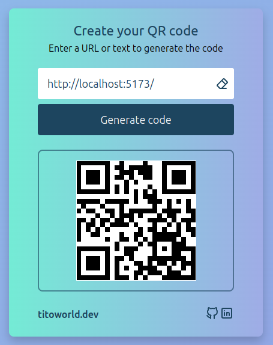

# QR Code Creator

QR code creator made with React.

- [EN](#EN)
- [ES](#ES)

---

#### EN

##### Introduction

In this project, I used React to made this QR code creator that is simply and nice. But under this simplicity, there are very React features.

Features as components, styles, useState, useRef, useContext, HTTP calls to API with fetch, promises...

It is not the biggest project but works fine to prove my knowledge of React.

And if that was not enough, is something util for many uses.

##### How it works?

Well, possibly it is not necessary to explain how the app works, but here we go.

1. Copy and paste an url or text in the input  
   
2. Click the generate button and wait  
   
3. You should to have the QR code generated  
   
4. Read the code with your QR reader app

I hope this helps you and that you enjoy the app.

##### Screenshots

---

#### ES

##### Introducción

En este proyecto, he usado React para crear este creador de códigos QR que es simple y agradable. Pero bajo esta simplicidad, hay muchas características de React.

Características como componentes, estilos, useState, useRef, useContext, llamadas HTTP a API con fetch, promesas...

No es el proyecto más grande pero funciona bien para demostrar mi conocimiento de React.

Y por si fuera poco, es algo útil para muchos usos.

##### ¿Cómo funciona?

Bueno, posiblemente no es necesario explicar como funciona la aplicacion, pero aquí vamos.

1. Copia y pega una url o texto en el input  
   
2. Haz click en el boton de generar y espera  
   
3. Deberías tener el código QR generado  
   
4. Lee el código con tu aplicación para leer códigos QR

Espero que esto te ayude y que disfrutes la app.

##### Capturas de pantalla

